# Music Recording Company System

A **Java Project** with *PostgreSQL* as backend. 

## Description

A GUI application created using *Java Swings, AWT and JDBC Client* to interface a Database **Music Recording Company** deployed in *PostgreSQL*.

## Requirements

* Java SE JDK 11+
* *PostgreSQL* or *MySQL* for backend
* JDBC Connector for *PostgreSQL* or *MySQL*
* *Eclipse Workspace for Java SE Developers (Optional) or any IDE that supports Java*

## Workflow

* A User  can login with a privilege of either **Admin** or **Local**.
* *Local user* can only display the table contents.
* *Admins* can insert, delete and update values as well.
* If the validation was **Unsuccessful**, a failed message would be displayed.
* All the operations return a *returnCode* which implies if the execution of the queries were **Successful**.
* A Special case exists wherein Upon *Inserting a New Song* and *Mapping its Musician*, the Program **internally calls** the *IncrementSong()* or *IncrementComposed()* method which updates the *Songs_Sung* or *Songs_Composed* by the Musician and **Increments it without any User Intervention.**

## Watchout!
* [ConnectDB.java](https://github.com/neerajsk911/MusicRecordingCompany/blob/324550c5b7f0b2c5c688a613ae628e0db23f7c3f/src/databases/ConnectDB.java) in the package **databases** is responsible for **retrieving the connection** from the database using JDBC operations. The Database name , Username and Password **as mentioned in the file** is evaluated to retrieve the connection. Therefore it must be **updated** following the requirements of the DB.

## UML Relations

* ***Use Case Diagram:***

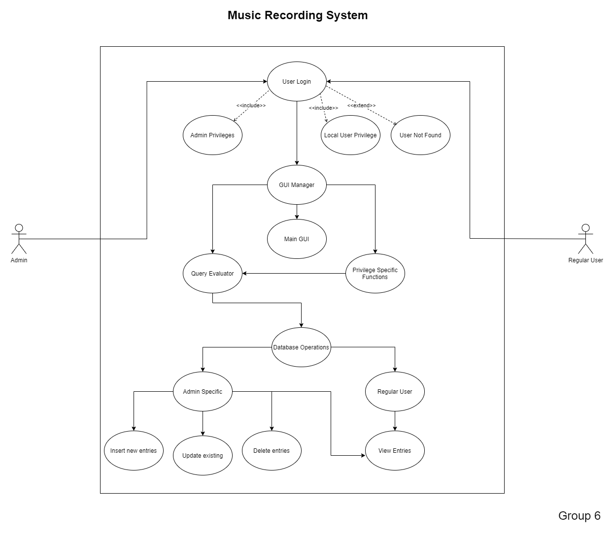

* ***Class Diagram:***

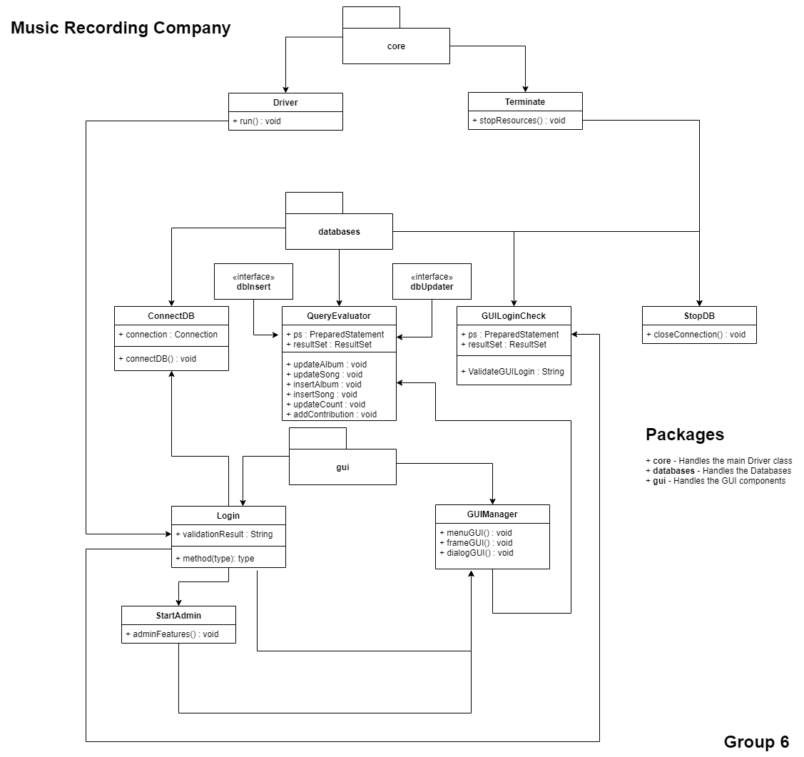

* ***ER Diagram for the Database:***

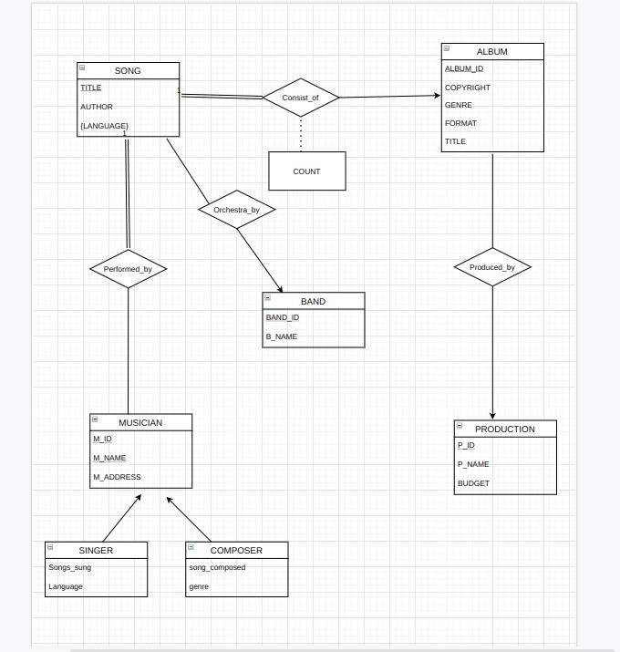

*All the UML relation are expected results. Actual Structure of the Program can possibly differ from the UML*

## Backend Details
* The entity sets in the following project are:
* *Song*
* *Musician*
* *Album*
* *Production*
* *Band*
* *Singer*
* *Composer*

* A **Many to Many relation** – *‘Performed By’* is mapped between the entity sets
Musician and Song with a Total participation of Song in ‘Performed By’ as the
Minimum cardinality for the relation is expected to be >=1 as there always exists
a Musician for a particular Song.
* A **Many to One relation** – *‘Consist of’* is mapped between the entity sets Song and
Album as Many songs can be a part of an Album with a Total Participation of Song
in ‘Consists of’ as a Minimum of 1 song is expected to be present in an Album.
* A **One to Many relation** – *‘Produced By’* is mapped between the entity sets Albums
and Productions wherein it is expected that a particular Album is Produced By
only a single Production whereas a Single Production can Produce many Albums.
* A **Many to One relation** – *‘Orchestra By’* is mapped between the entity sets Song and Band considering a Single Band can Orchestrate multiple songs whereas a
particular Song can be Orchestrated by only a Single Band.
* The entity sets *Singer* and *Composer* serve as a **Specialization** for the entity set Musician.

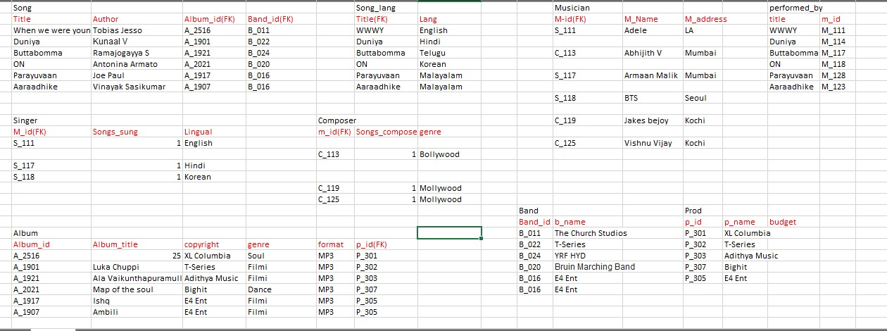

*Sample relations in the Database*

## Screenshots

* ***Login Page:***

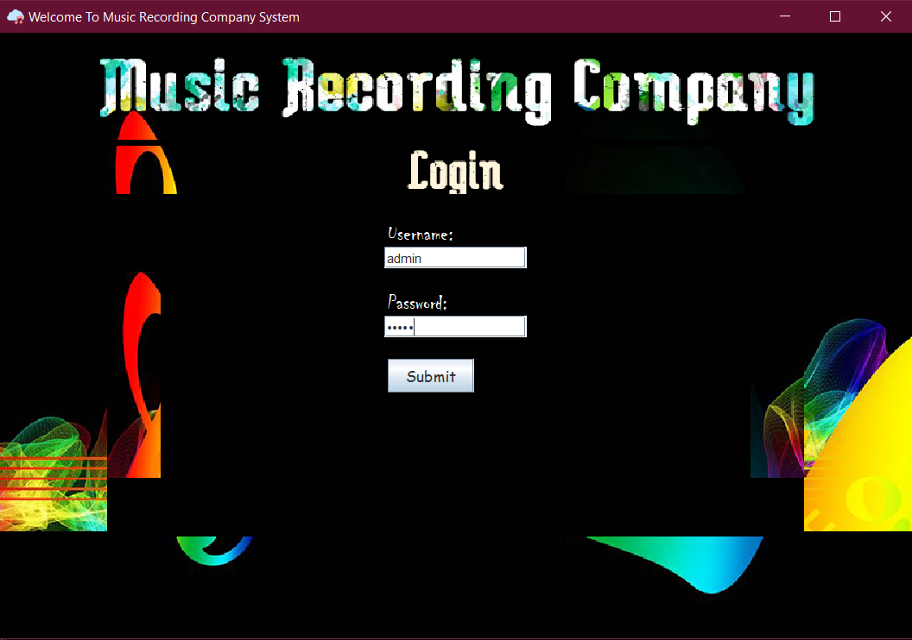

*Username: admin     Password: musicdb (as inserted in loginDB table of database)*

*Username: regular    Password: imreguser (Regular User)*

* ***Failed Validation:***

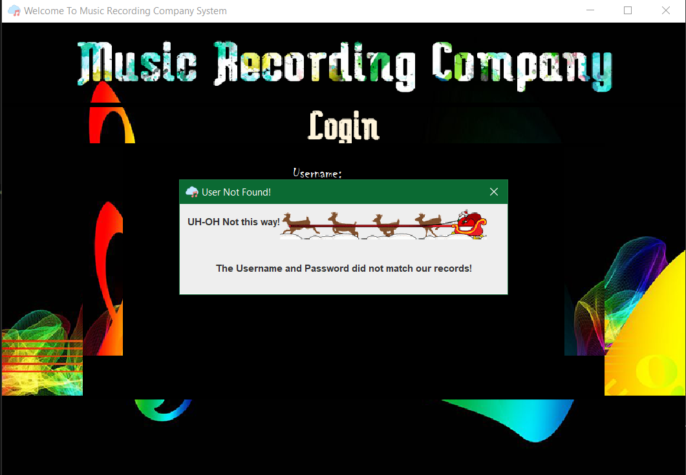

* ***Functionalities after logging as Admin:***

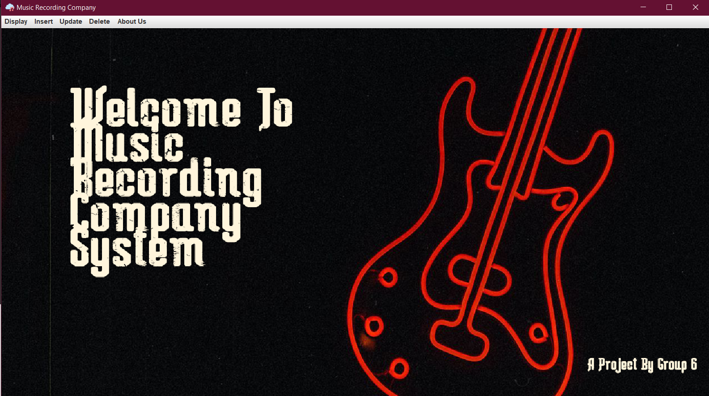

*Admin can Insert, Update and Remove the Database contents apart from Displaying*

* ***Functionalities after logging as Regular User:***

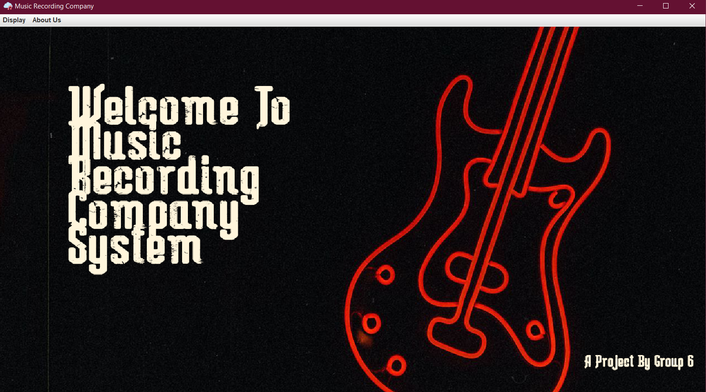

* ***UI Icons:***

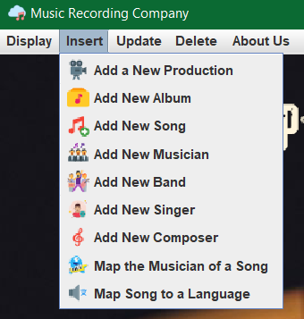

* ***Displaying a Record from Database:***

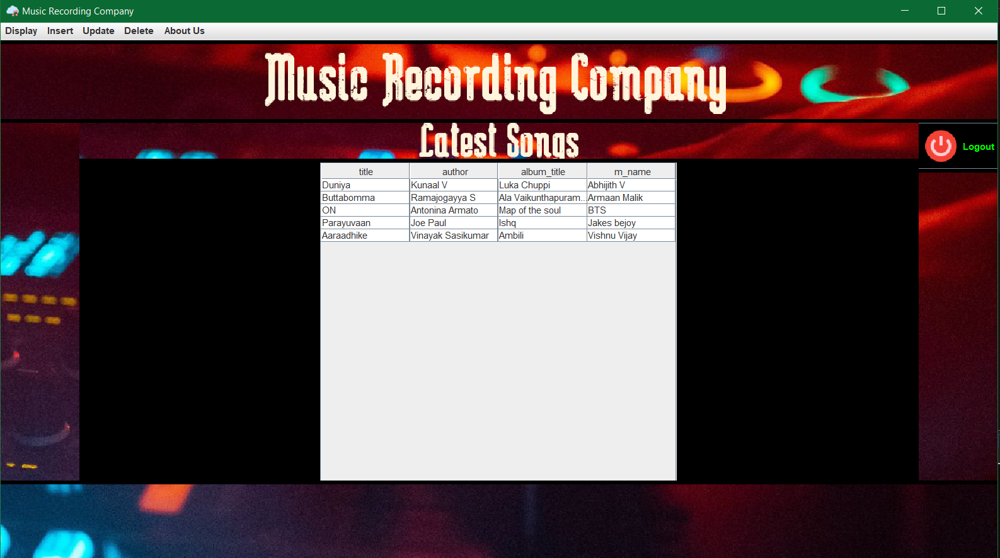

* ***Adding a New Song:***

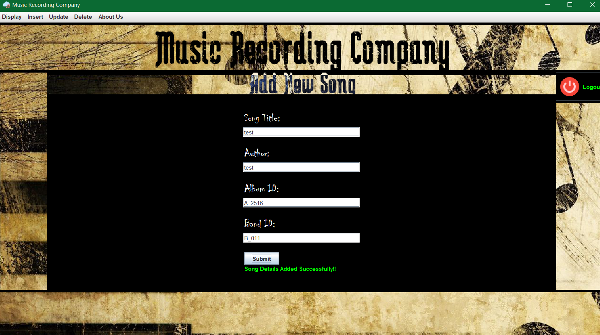

* ***Updating a Production details:***

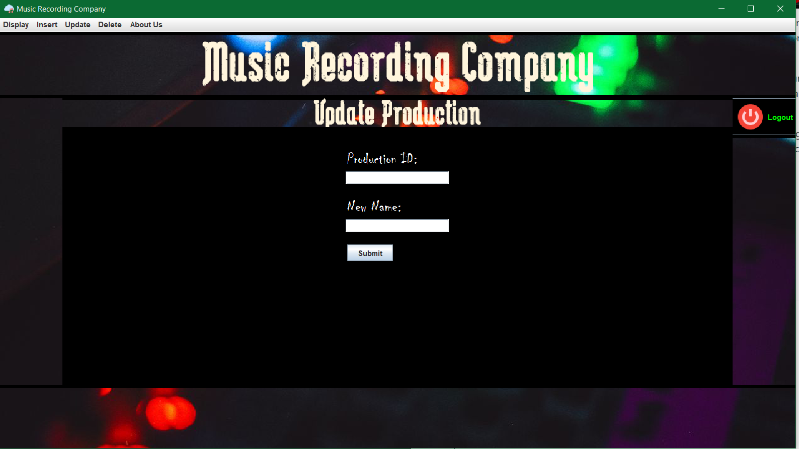

* ***About Us:***

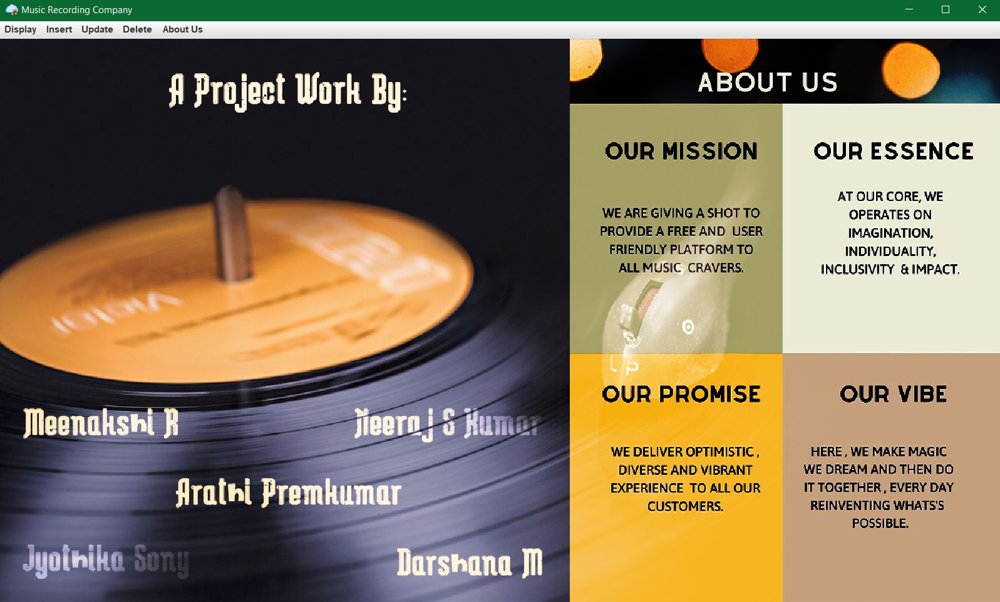

## Class Description

* Package: **core**

  * **Driver.java ** - **Driver code** *for the Application*
  * *Terminate.java - Terminates the JDBC Connections*

* Package: **databases**

  * *ConnectDB.java  - Connects the JDBC Client*
  * *GUILoginCheck.java - Validates the Login Credentials used at Start*
  * **QueryEvaluator.java**  - **Mainstream Query Processor** *which sends all JDBC requests*
  * #### Interfaces:

  * *dbDisplay.java  - Consists of SQL Queries as methods to perform Display Operations*
  * *dbInsert.java  - Consists of SQL Queries as methods to perform Insert Operations*
  * *dbUpdater.java  - Consists of SQL Queries as methods to perform Update Operations*
  * *RecordRemover.java  - Consists of SQL Queries as methods to perform Delete Operations*

* Package: **gui**

  * *GUIManager.java  - Handles the GUI for Load Animations*
  * *Login.java -  Handles the GUI for Initial Login Screen*
  * **StartAdmin.java**  *- **Core GUI Handler**. Manages the GUI for the Entire Application*
  * #### Interfaces:

  * *Messages.java  - Handles the Success/Fail messages Displayed in the Application*
  * *ResourcePaths.java  - Contains the Path to all the Resources used in the Application*

## Devs:

*This Project was Created as a part of the Course [**Object Oriented Programming(19CSE202)**](https://amritauniv.sharepoint.com/sites/ObjectOrientedProgrammingJune-Dec2020/) by Group 6 S3 CSE-C, Amrita School of Engineering,Amritapuri*
* ***Neeraj S Kumar***
* ***Meenakshi R***
* ***Arathi Premkumar***
* ***Darshana Manojkumar***
* ***Jyothika Sony***

##### Connect With Me: [LinkedIn](https://www.linkedin.com/in/neeraj-s-kumar-938161129)